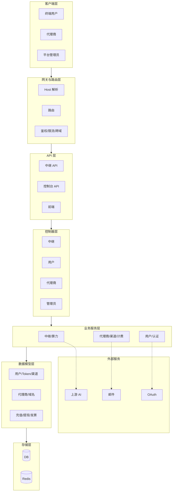
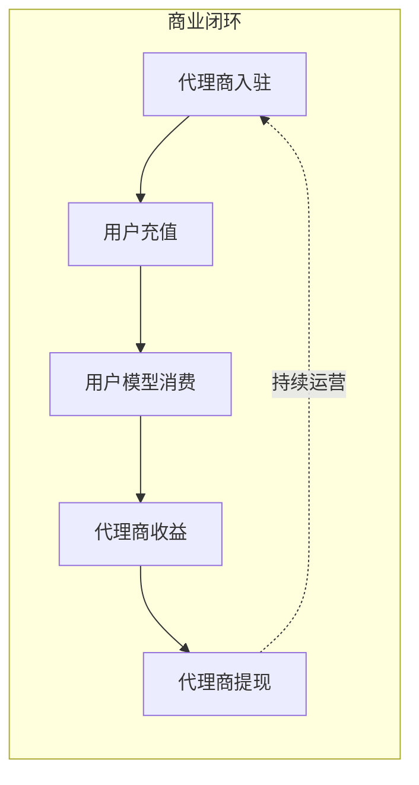
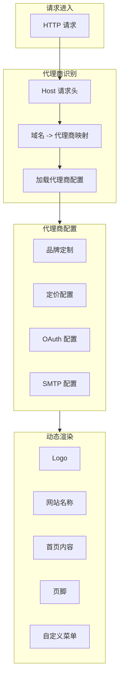

# new-api + 算力分销代理商运营系统 技术框图

基于功能清单与路线图文档，绘制完整技术框图。

## 技术框图（Mermaid 格式）

## 业务闭环流程图

## 代理商差异化架构

## 模块功能矩阵

| 模块 | 功能要点 | 对应路由/服务 |
|------|----------|---------------|
| 代理商基础架构 | 域名绑定、Host 识别、品牌定制 | middleware/Distribute, model/Agent |
| 用户注册与归属 | 自动绑定代理商、渠道码、跨域登录 | controller/User, service/User |
| 实名认证 | 申请、审核、加密存储 | controller/User, model/User |
| 账单管理 | 充值、发票、提现 | controller/Billing, service/Billing |
| 代理商用户管理 | 用户列表、搜索、详情、统计 | controller/Agent, service/Agent |
| 代理商渠道管理 | 渠道增删改查、统计 | controller/Agent, model/AgentChannel |
| 代理商数据看板 | 概览、消费明细、API 统计 | controller/Agent, service/Stats |
| 代理商系统设置 | 基础/定价/SEO/SMTP/OAuth/协议 | controller/Setting, model/AgentOption |
| 管理员-代理商 | 创建、编辑、额度、佣金 | controller/Admin, service/Admin |
| 管理员-用户 | 发票审核、提现审核 | controller/Admin |
